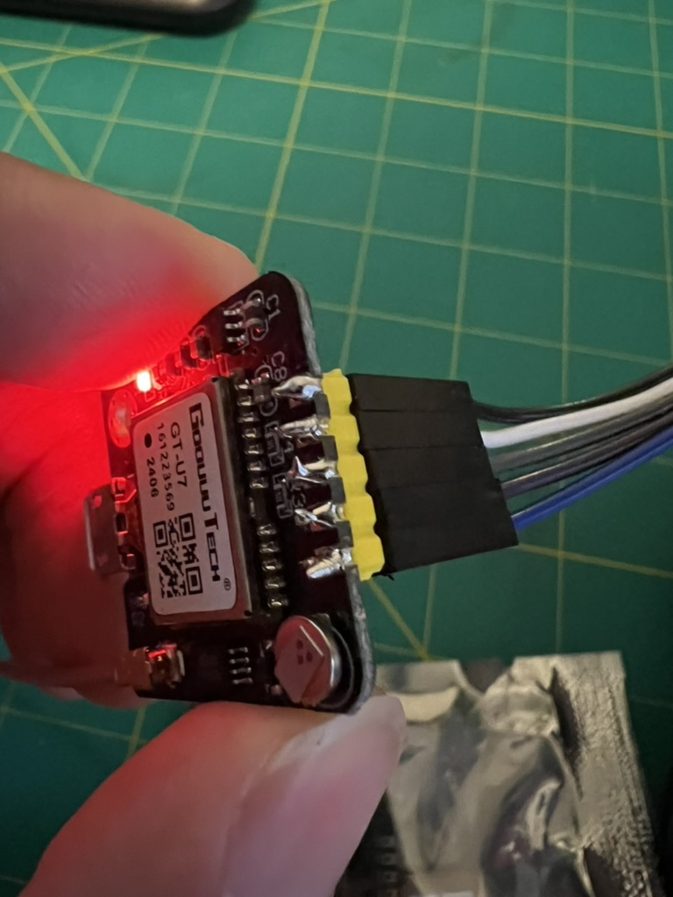
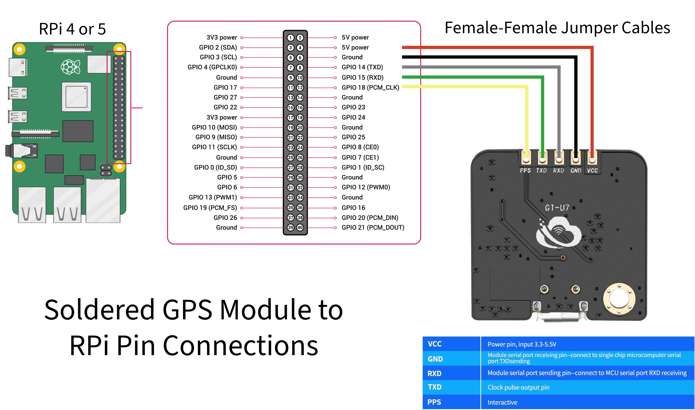
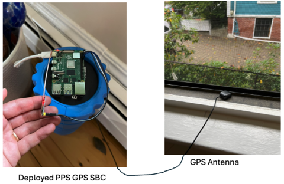

# PPS GPS Raspberry Pi Setup

This guide outlines the steps to set up the PPS GPS Raspberry Pi, including the hardware connection of the GPS module/antenna to the Raspberry Pi and the system configuration to accept and publish the GPS signal to other devices over your Local Access Network (LAN).

## Components Used

- **Raspberry Pi 4 or 5** 
- **GPS Module**: [NEO-6M GPS Module](https://www.amazon.com/dp/B07P8YMVNT?ref=ppx_yo2ov_dt_b_fed_asin_title)
- **GPS Antenna**: [GPS Active Antenna](https://www.amazon.com/gp/product/B083D59N55/ref=ppx_yo_dt_b_asin_title_o01_s00?ie=UTF8&psc=1)
- **Soldering Kit**
- **5 Female-Female Jumper Cables** 

> **Note**: Soldering is required to connect the antenna to the GPS module. Follow the steps below to properly set up the hardware and configure the Raspberry Pi.

---

## Step 1: Soldering the Pins to the GPS Module

The GPS module needs to be soldered to pins to enable the connection with the Raspberry Pi.

### Soldering Steps:

1. **Prepare the soldering iron** and make sure the GPS module pins are clean.
2. **Solder the pins** to the appropriate solder points on the GPS module.
3. Ensure there are no loose connections, and double-check the solder joints. Ensure no bridges between pin connections. 



---

## Step 2: Connect the GPS Module to the Raspberry Pi

After soldering the antenna to the GPS module, the next step is to connect the GPS module to the Raspberry Pi's GPIO pins using female to female jumper cables.

### Pin Connections:

- **VCC**: Connect the VCC Pin from the GPS module to 5V Power Pin on the Raspberry Pi (pin 4).
- **GND**: Connect the GND pin from the GPS module to a GND pin on the Raspberry Pi (pin 6).
- **RXD**: Connect the RXD pin from the GPS module to the Raspberry Pi GPIO 14  (pin 8).
- **TXD**: Connect the TXD pin from the GPS module to the Raspberry Pi GPIO 15 (pin 10).
- **PPS**: Connect the PPS pin from the GPS module to the Raspberry Pi GPIO 18 (pin 12).



---


## Step 3: Flash a 64-bit Raspberry Pi OS Lite to the Raspberry Pi

To ensure optimal performance and compatibility for a headless server setup, it's recommended to use the **64-bit Raspberry Pi OS Lite** on your Raspberry Pi 4 or 5.

### Steps to Flash the OS:

1. **Download the Raspberry Pi Imager**:

   - Visit the [Raspberry Pi Downloads page](https://www.raspberrypi.com/software/) and download the Raspberry Pi Imager suitable for your operating system (Windows, macOS, or Linux).

2. **Install the Raspberry Pi Imager**:

   - Run the installer you just downloaded and follow the on-screen instructions to install the Raspberry Pi Imager.

3. **Prepare a microSD Card**:

   - Use a microSD card with at least **16GB** of storage for better performance and longevity.
   - Insert the microSD card into your computer's card reader.

4. **Launch the Raspberry Pi Imager**:

   - Open the Raspberry Pi Imager application.

5. **Choose the OS**:

   - Click on **"Choose OS"**.
   - Navigate to **"Raspberry Pi OS (other)"**.
   - Select **"Raspberry Pi OS Lite (64-bit)"**.

6. **Select the microSD Card**:

   - Click on **"Choose Storage"**.
   - Select your microSD card from the list.

7. **Configure Advanced Settings (Optional)**:

   - Click on the **gear icon** or press **Ctrl+Shift+X** to open the advanced settings.
   - **Enable SSH**: Check the box to enable SSH for remote access.
   - **Set Hostname**: Assign a unique hostname for your Raspberry Pi.
   - **Configure Wi-Fi** (if applicable): Enter your Wi-Fi SSID and password.
   - **Set Locale Settings**: Configure the locale, timezone, and keyboard layout.
   - **Save** the settings by clicking **"Save"**.

   > **Note**: Configuring SSH and network settings here allows for headless setup without needing a monitor or keyboard.

8. **Write the OS to the microSD Card**:

   - Click on **"Write"**.
   - Confirm any prompts to begin the flashing process.
   - Wait for the process to complete; this may take several minutes.

9. **Safely Remove the microSD Card**:

   - Once the writing and verification are complete, safely eject the microSD card from your computer.

10. **Boot the Raspberry Pi**:

    - Insert the microSD card into the Raspberry Pi.
    - Connect the Raspberry Pi to your network via Ethernet (recommended for initial setup).
    - Power on the Raspberry Pi and allow it to boot into Raspberry Pi OS Lite.

11. **Initial Setup via SSH**:

    - Find the Raspberry Pi's IP address on your network (you can use tools like `nmap` or check your router's connected devices list).
    - Open a terminal on your computer and connect via SSH:

      ```bash
      ssh pi@<Raspberry_Pi_IP_Address>
      ```

      Replace `<Raspberry_Pi_IP_Address>` with the actual IP address.

    - **Default Credentials**:
      - **Username**: `pi`
      - **Password**: `raspberry` (change this immediately after first login for security).

    - **Update the System**:

      ```bash
      sudo apt update
      sudo apt full-upgrade -y
      sudo reboot
      ```

    - After rebooting, reconnect via SSH to continue with the setup.

---

## Step 4: Install and Set Up the GPS Antenna

Place the GPS antenna in a location with a clear view of the sky to ensure good satellite reception. Use the provided cables to connect the antenna to the GPS module's antenna port (Snap fit to GPS module, coaxial style cable to antenna).

### Antenna Placement Tips:

- Make sure the antenna is placed **outdoors** or near a **window** for optimal satellite reception.
- The antenna should be **fixed** securely to avoid any movement that could interrupt the signal.



---

## Step 5: Enable UART and PPS on the Raspberry Pi

1. Open the Raspberry Pi configuration tool:

   ```bash
   sudo raspi-config
   ```

2. Navigate to **Interfacing Options > Serial**, disable the console, AND enable the serial hardware.

3. Install necessary software:

   ```bash
   sudo apt update
   sudo apt install gpsd gpsd-clients chrony pps-tools
   ```

4. Add the following lines to `/boot/firmware/config.txt`:

   ```conf
   dtoverlay=pps-gpio,gpiopin=18
   enable_uart=1
   ```

5. Reboot the Raspberry Pi:

   ```bash
   sudo reboot
   ```

---

## Step 6: Verify GPS and PPS Signals

Check that the GPS module is recognized:

```bash
cgps -s
```

Verify that the PPS signal is detected:

```bash
sudo ppstest /dev/pps0
```

---

## Step 7: Configure Chrony to Use PPS GPS Signal

Edit `/etc/chrony/chrony.conf` to add the following lines:

```conf
refclock PPS /dev/pps0 poll 2 refid PPS
refclock SHM 0 poll 3 refid GPS
```

Restart Chrony:

```bash
sudo systemctl restart chrony
```

---

## Step 8: Publish the GPS Time to Other RPi Nodes

To publish the GPS time to other Raspberry Pis on the local network, set up the PPS GPS Pi as an NTP server.

Add the following lines to `/etc/chrony/chrony.conf`:

```conf
allow 192.168.68.0/24
local stratum 1
```

Restart Chrony:

```bash
sudo systemctl restart chrony
```

The PPS GPS Raspberry Pi is now configured to act as a Stratum 1 NTP server for your local network.

---

## Step 9: Configure Other Raspberry Pis to Use the GPS PPS Signal

On the other Raspberry Pis, you'll need to configure them to prefer the PPS GPS time signal from the central Raspberry Pi. In the `/etc/chrony/chrony.conf` file on each RPi, add the following lines:

Add the IP address of the PPS GPS RPi as the preferred time source:

```conf
server 192.168.XXX.XXX iburst prefer minpoll 4 maxpoll 4
```

Replace `192.168.XXX.XXX` with the actual IP address of the PPS GPS Raspberry Pi.

Add backup NTP servers (e.g., Google NTP servers):
```conf
server time1.google.com iburst minpoll 4 maxpoll 6
server time2.google.com iburst minpoll 4 maxpoll 6
server time3.google.com iburst minpoll 4 maxpoll 6
server time4.google.com iburst minpoll 4 maxpoll 6
```

Restart Chrony on each RPi:

```bash
sudo systemctl restart chrony
```

---

## Conclusion

By following this guide, you have successfully set up the PPS GPS Raspberry Pi to act as a Stratum 1 NTP server, and configured the other Raspberry Pis to synchronize their time using this GPS source with Google NTP servers as a backup.

Option to build another for redundancy, and include it in the chrony.conf file.


